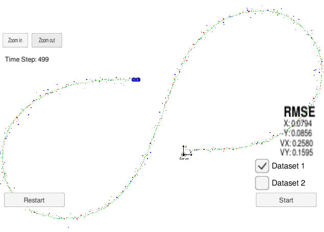

# Unscented Kalman Filter
Self-Driving Car Engineer Nanodegree Program

Red circles are lidar measurements. Blue circles are radar measurements. Green points are the estimated locations of the car.

In this project utilize an Unscented Kalman Filter to estimate the state of a moving object of interest with noisy lidar and radar measurements. 

INPUT: values provided by the simulator to the c++ program

["sensor_measurement"] => the measurment that the simulator observed (either lidar or radar)

OUTPUT: values provided by the c++ program to the simulator

["estimate_x"] <= kalman filter estimated position x

["estimate_y"] <= kalman filter estimated position y

["rmse_x"]

["rmse_y"]

["rmse_vx"]

["rmse_vy"]

---
## Results
Residual error is calculated by mean squared error (MSE).

| Input      | MSE| Requirement (less than) |
| :--------:   | :-----:   | :----:|
| px         | 0.0794   | 0.09   |
| py         | 0.0856   | 0.10    | 
| vx         | 0.2580   | 0.40    | 
| vy         | 0.1595   | 0.30    | 

### Comparisons
I included the results of only running one sensor ar a time (lidar or radar). as well as the results of my previous [Extended Kalman Filter](https://github.com/YuxiangJohn/Self_driving_car_term2/tree/master/Extended_Kalman_Filter) for the same dataset. As expected, the UKF combined with both of two sensors is the most accurate (lowest MSE) of this result.

| Input      | UKF-Fused| UKF-Lidar | UKF-radar| EKF-Fused |
| :--------:   | :-----:   |  :-----:  | :-----:  | :------:  |
| px         | 0.0794   | 0.1057    | 0.1570   | 0.0973    |
| py         | 0.0856   | 0.0946    | 0.2043   | 0.0855    |
| vx         | 0.2580   | 0.6033    | 0.2843   | 0.4513    |
| vy         | 0.1595   | 0.1936    | 0.2202   | 0.4399    |

Compared to EKF, UKF is outstanding when predicting velocity.

## Dependency and Compiling
This project involves the Term 2 Simulator which can be downloaded [here](https://github.com/udacity/self-driving-car-sim/releases)

This repository includes two files that can be used to set up and intall [uWebSocketIO](https://github.com/uWebSockets/uWebSockets) for either Linux or Mac systems. For windows you can use either Docker, VMware, or even [Windows 10 Bash on Ubuntu](https://www.howtogeek.com/249966/how-to-install-and-use-the-linux-bash-shell-on-windows-10/) to install uWebSocketIO. Please see [this concept in the classroom](https://classroom.udacity.com/nanodegrees/nd013/parts/40f38239-66b6-46ec-ae68-03afd8a601c8/modules/0949fca6-b379-42af-a919-ee50aa304e6a/lessons/f758c44c-5e40-4e01-93b5-1a82aa4e044f/concepts/16cf4a78-4fc7-49e1-8621-3450ca938b77) for the required version and installation scripts.

Once the install for uWebSocketIO is complete, the main program can be built and ran by doing the following from the project top directory.

1. mkdir build
2. cd build
3. cmake ..
4. make
5. ./UnscentedKF

### Other Important Dependencies
* cmake >= 3.5
  * All OSes: [click here for installation instructions](https://cmake.org/install/)
* make >= 4.1 (Linux, Mac), 3.81 (Windows)
  * Linux: make is installed by default on most Linux distros
  * Mac: [install Xcode command line tools to get make](https://developer.apple.com/xcode/features/)
  * Windows: [Click here for installation instructions](http://gnuwin32.sourceforge.net/packages/make.htm)
* gcc/g++ >= 5.4
  * Linux: gcc / g++ is installed by default on most Linux distros
  * Mac: same deal as make - [install Xcode command line tools](https://developer.apple.com/xcode/features/)
  * Windows: recommend using [MinGW](http://www.mingw.org/)

